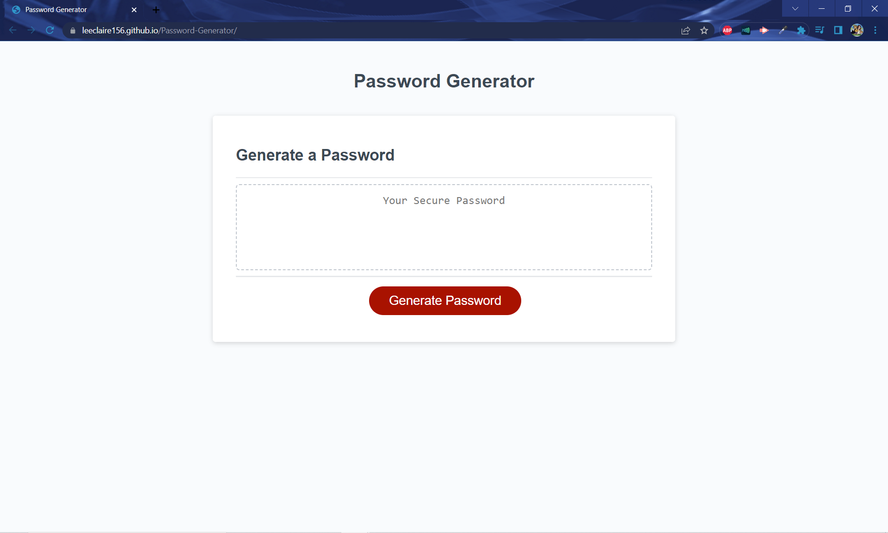
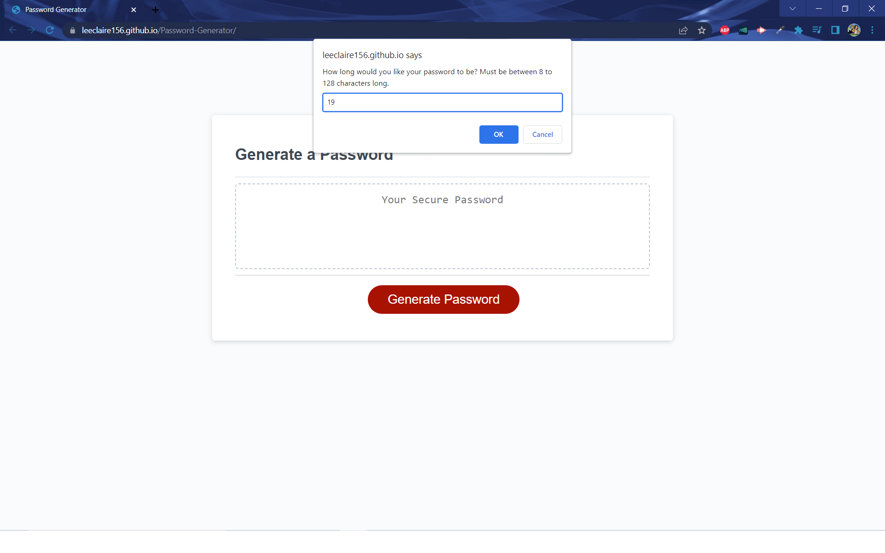
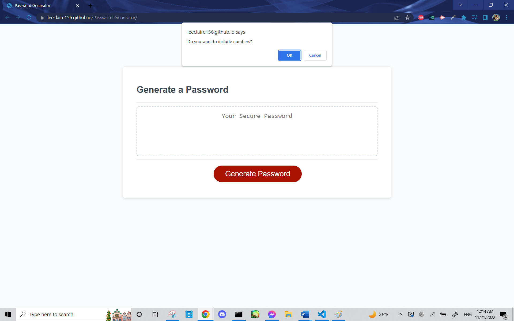
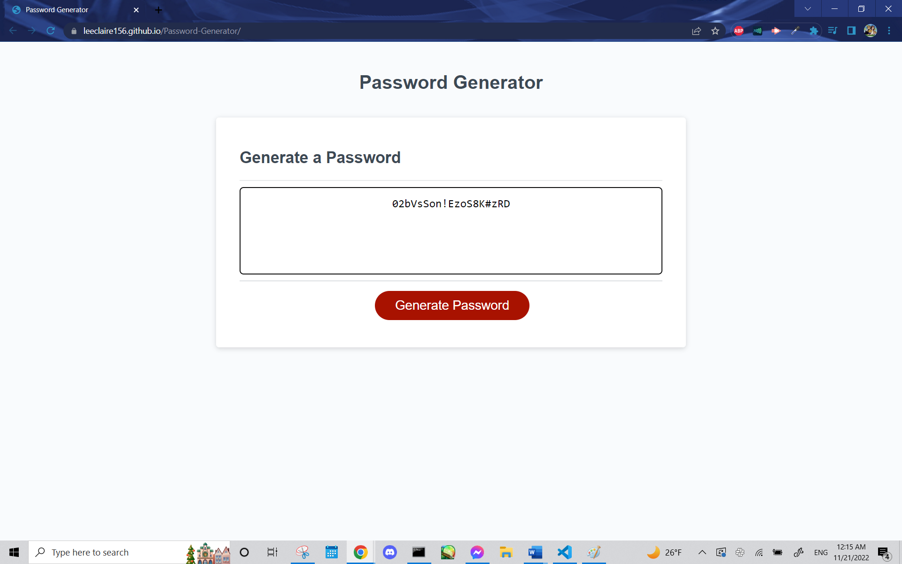

# Password Generator

## Description
This project utilizes javascript to build a random password generator that creates a password based on the character length and the character types desired. The user can create passwords between 8 to 128 characters and can include any combination of special characters, numbers, lowercase letters, and uppercase letters. Special characters include "!", "@", "#", "$", "%", "^", "&", "*", "(", and ")".

## Usage

* Please click on the following link of the deployed website, https://leeclaire156.github.io/Password-Generator/

* Click the Generate Password button to follow a series of prompts that will determine the type of password generated.

* Users will first be asked to put input the length of the password they desire. Then, they will be asked whether they want the following character types: special characters, numbers, lowercase letters, and uppercase letters.

* Clicking "OK" will include that character type while clicking "Cancel" will exclude that character type from password generation.

* The following display should appear on screens upon load:

    

* The following display should appear on screens after clicking the Generate Password button:

    

* The following displays should appear after inputting the desired password length:

    

    
    
    

    

    

## Credits

* Credit belongs to Myles Smith for sharing his logic approach during class for this assignment.

* Credit belongs to [Grossbard1849](https://www.reddit.com/r/AskProgramming/comments/katbot/javascript_help_with_password_generator/) for exposure and usage of the addition assignment operator, which was used to streamline the confirmation dialog boxes' javascript code format. Additional understanding of the addition assignment operator was supplemented by [Mastering JS](https://masteringjs.io/tutorials/fundamentals/string-concat).

* Credit belongs to [GeeksforGeeks.org](https://www.geeksforgeeks.org/how-to-generate-a-random-password-using-javascript/) for script.js line 60 within the loop which is responsible for generating the passwordSelected variable using the addition assignment operator and, more notably, the charAt method. Additional understanding of the charAt method was supplemented by [W3Schools](https://www.w3schools.com/java/ref_string_charat.asp#:~:text=The%20charAt()%20method%20returns,is%201%2C%20and%20so%20on.).